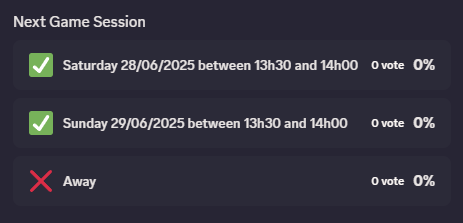
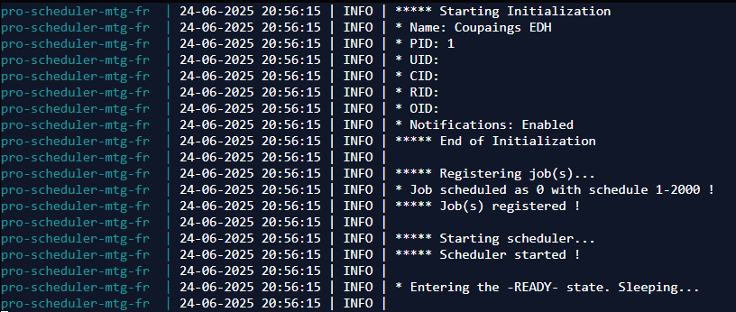

# Summary
Hello there,<br>
This small Discord bot written in Python3 allows you to schedule events weekly on Discord using the newest [Poll feature](https://discordpy.readthedocs.io/en/latest/api.html?highlight=poll#poll) based on [discord.py package](https://pypi.org/project/discord.py/).
Below you'll find everything you need to use the bot.

# Results
### <p align="center">Poll rendered in Discord</p>
<br>
### <p align="center">Logs rendered in [Dokémon](https://github.com/productiveops/dokemon)</p>
<br>

# Requirements
* [Discord.py (2.5.2)](https://pypi.org/project/discord.py/)
* [APScheduler (3.10.4)](https://pypi.org/project/APScheduler/)
* [Docker (28.0.4)](https://docs.docker.com/)
* Knowledge about Docker, environment variables and deployments
* OPTIONAL: A GUI tool like Dokémon, Rancher, etc...

# Deployment
* Update variables in the ```docker-compose-default-scheduler.yml```
* Build & run the image ```docker compose -f docker-compose-default-scheduler.yml up```
* Check the logs

# Environment variables
## Basics
* ROLE_ID
    - Role ID to mention with the poll
    - Format: encapsulated string: '<@&154785693>'
* CHANNEL_ID
    - Channel ID to send the poll in
    - Format: basic string: '154785693'
* BOT_OWNER_ID
    - Owner ID to filter over commands
    - Format: basic string: '154785693'
* TOKEN
    - Discord token ([see docs](https://discord.com/developers))
    - Format: basic string: '154785693'
* NOTIFY
    - With False, nothing will be sent, the bot will be used with commands only
    - Format: boolean: 'True' or 'False'
## Commands
* PREFIX_CMD
    - The prefix to add for all commands
    - Format: basic string: '_es'
* FORCE_SCHEDULE_CMD
    - Used to force schedule an event, will be <PREFIX_CMD><FORCE_SCHEDULE_CMD>
    - Format: basic string: '_force'
* ENABLE_SCHEDULER_CMD
    - The command to enable notifications, will be <PREFIX_CMD><ENABLE_SCHEDULER_CMD>
    - Format: basic string: '_enable'
* DISABLE_SCHEDULER_CMD
    - The command to disable notifications, will be <PREFIX_CMD><DISABLE_SCHEDULER_CMD>
    - Format: basic string: '_disable'

# Known bugs
/