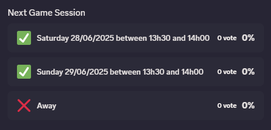

# Summary
Hello there,<br>
This small Discord bot written in Python3 allows you to schedule events weekly on Discord using the newest [Poll feature](https://discordpy.readthedocs.io/en/latest/api.html?highlight=poll#poll) based on [discord.py package](https://pypi.org/project/discord.py/).
Below you'll find everything you need to use the bot.

# Results
### <p align="center">Poll rendered in Discord</p>
<br>

# Requirements
* [Discord.py (2.5.2)](https://pypi.org/project/discord.py/)
* [APScheduler (3.10.4)](https://pypi.org/project/APScheduler/)
* [Docker (28.0.4)](https://docs.docker.com/)
* Knowledge about Docker, environment variables and deployments.
* OPTIONAL: A GUI tool like Dokémon, Rancher, etc...

# WIP

# Deployment
* OPTIONAL: Update your world's background using the *Administrator Setup*.
* Set the ```Join Page Theme``` to ```Minimal``` using the *World Setup*.
* Upload your world logo in your FoundryVTT instance.
    * I advise you to use the *Administrator Setup* in the same way as if you were updating the world's background WITHOUT clicking on *Update World*. This will upload the file in the root directory of your FoundryVTT instance.
* Overwrite your ```$foundry_path/resources/app/templates/setup/parts/join-form.hbs``` with [the one in the repo](join-form.hbs).
* Concatenate your ```$foundry_path/resources/app/public/css/foundry2.css``` with (for example) [The Witcher style](the-witcher/foundry2.css).
* Don't forget to configure your updated CSS in the [*Configuration Area*](the-witcher/foundry2.css#L10).

# Known bugs
* If you upgrade your instance of FoundryVTT, you'll loose everything related to this package (backups are your friends).

# Credits
### <p align="center">*I do not own any logos and/or backgrounds shown here. I will remove them if I violate any laws and/or intellectual property. Ask me in the [Issues](https://github.com/Doluprane/foundryvtt-login-pages/issues) tab of the project.<br>I am not affiliated with any brands shown in this GitHub repository.*</p>
<br><p align="center">This is more or less a fork from [dandln](https://github.com/dandln/Foundry-VTT-Prettier-Login-Screen) based on a code of [u/bass-blowfish](https://www.reddit.com/user/bass-blowfish/).<br>If you read this, thank you guys, this is great job and I was greatly inspired by what you achieved !</p><br>

* Vaesen
    * Background and logo are taken from [Free League Publishing](https://freeleaguepublishing.com/) ([Website](https://freeleaguepublishing.com/games/vaesen/) and/or [Rulebooks](https://freeleaguepublishing.com/shop/vaesen-2/vaesen-nordic-horror-roleplaying/)).

* Tales From The Loop 
    * Background is taken from [Swedish Machines](https://www.simonstalenhag.se/svema.html) book from [Simon Stålenhag](https://www.salomonssonagency.se/simon-stalenhag).
    * Logo is taken from [Free League Publishing](https://freeleaguepublishing.com/) ([Website](https://freeleaguepublishing.com/games/tales-from-the-loop-rpg/) and/or [Rulebooks](https://freeleaguepublishing.com/shop/tales-from-the-loop/core-rulebook/)).

* Dungeons & Dragons
    * Background and logo are taken from [Wizards of the Coast](https://company.wizards.com/) ([Website](https://dnd.wizards.com/) and/or [Rulebooks](https://marketplace.dndbeyond.com/category/dungeon-masters-guide/)).

* The Witcher
    * Background is taken from [Wallhere](https://wallhere.com/en/wallpaper/1931009/) from artist [CelenaHehr](https://wallhere.com/en/user/3600649/).
    * Logo is taken from [CD Projekt RED](https://www.cdprojektred.com/) ([Website](https://www.thewitcher.com/)).

* Alien
    * Background and logo are taken from [Free League Publishing](https://freeleaguepublishing.com/) ([Website](https://freeleaguepublishing.com/games/alien/) and/or [Rulebooks](https://freeleaguepublishing.com/shop/alien-rpg-2/)).

* Twilight:2000
    * Background and logo are taken from [Free League Publishing](https://freeleaguepublishing.com/) ([Website](https://freeleaguepublishing.com/games/twilight-2000/) and/or [Rulebooks](https://freeleaguepublishing.com/shop/twilight-2000/)).

* Mutant:Year Zero
    * Background and logo are taken from [Free League Publishing](https://freeleaguepublishing.com/) ([Website](https://freeleaguepublishing.com/games/mutant-year-zero/) and/or [Rulebooks](https://freeleaguepublishing.com/shop/mutant-year-zero/)).

* Coriolis
    * Background and logo are taken from [Free League Publishing](https://freeleaguepublishing.com/) ([Website](https://freeleaguepublishing.com/games/coriolis/) and/or [Rulebooks](https://freeleaguepublishing.com/shop/coriolis/)).